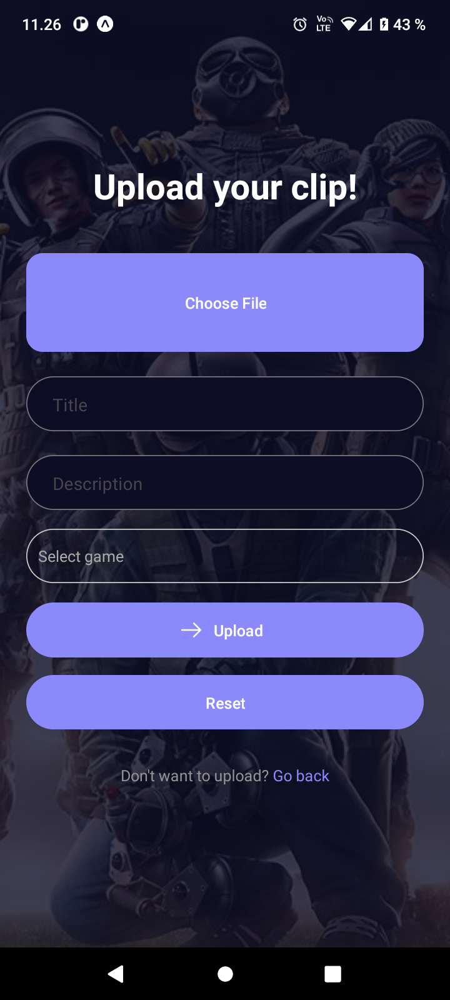
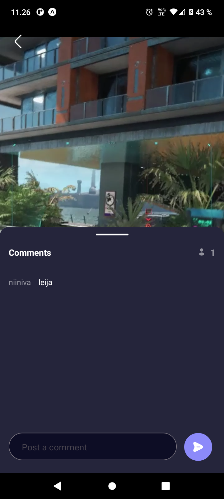

# GameClips
Share your best gaming moments with the world.

## Description
GameClips is a mobile application built using React Native. It is the ultimate platform for gamers to share their most epic and entertaining gaming moments, from utility lineups to funny glitches and everything in between. With its sleek and intuitive design, GameClips offers an immersive and engaging experience that rivals other popular social media platforms.

## Key Features

- Built using **Atomic Design** principles to ensure a consistent and intuitive user experience
- Utilizes the powerful **React Native Paper** library for flexible and dynamic UI design
- Integrates with the [rawg.io API](https://api.rawg.io/docs/) to fetch game information and provide enhanced functionality
- Backed by [Media API](https://media.mw.metropolia.fi/wbma/docs/), allowing for seamless upload and playing of high-quality game clips
- **Absolute imports**, which facilitates managing complex file structures and dependencies

## Installation
GameClips is already set up with pre-configured API keys and environment variables, so you can start using it right away by following these steps:
- Clone the repository
- Run `npm install`, then `npm start`

## Usage
- Install GameClips to your local device
- Create an account or log in if you already have one
- Upload your favorite gaming moments to share with the community
- Browse other users' clips and interact with them by liking, commenting, and sharing

## Screenshots

## Demo video

## Others
- Project management: [Trello board](https://trello.com/b/D8L11f8Q/web-based-mobile-project)
- Design prototype: [Figma](https://www.figma.com/file/S84gPK5QA63M2jY0y1CaWi/GameClips-mobile-app?node-id=0%3A1&t=sR3d69R6rhajfWmK-0)

## Contributors
1. Tomi Jumppanen
2. Valtteri Niininen
3. Dat Pham (Daniel)
